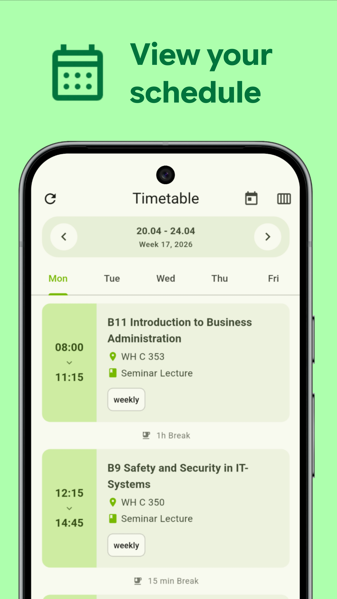
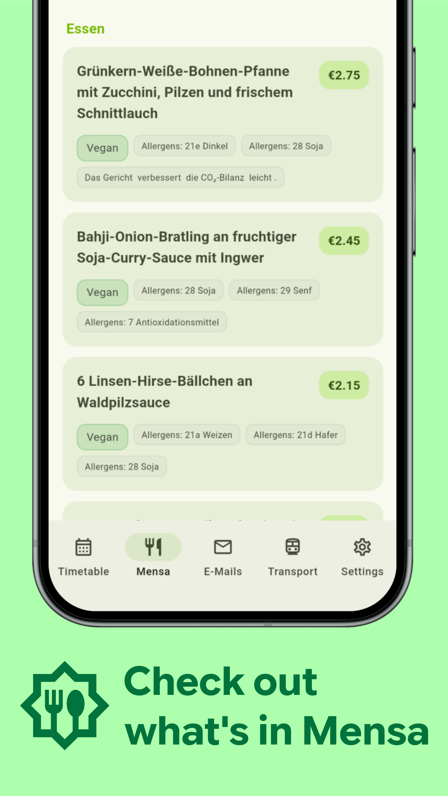
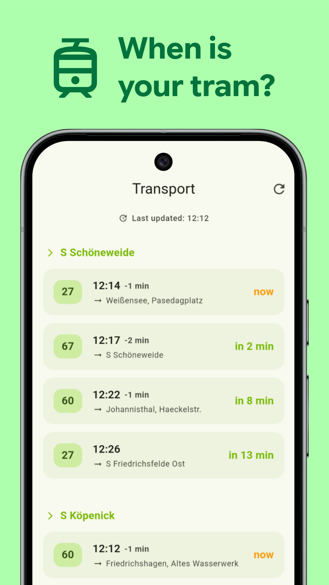

  

  <h1>Uniwe - HTW Berlin</h1>
  
  [**🇺🇸 English**](README.md) | [**🇩🇪 Deutsch**](README.de.md)
  
   

  

*If you don't know which version to download:*
* **arm64-v8a:** Almost certainly this one
* **universal:** If the first one doesn't work

---

### But why?

When I enrolled in October 2025, I was surprised to find that a university as large as HTW Berlin **didn't have its own mobile app**. I have no intention of using **Studo**, which is not only full of junk (authenticator, job search, feed... seriously??), but also requires your phone number and hides its basic functionality behind a “pro” subscription. Besides, the interface for both Studo and LSF hasn’t changed since 2010 (and that’s not even an exaggeration), so I decided that I could build a decent app for myself (and for you) - one that’s **beautiful, modern, completely free, and open-source**.

### Core Features
- **Timetable:** Automatically fetched from LSF and cleanly presented.
- **Webmail integration:** View your HTW Emails right in the app.
- **Mensa Menu:** Daily food plans from the HTW Berlin cafeterias.
- **Transport:** Live tram departures around campuses.
- **Secure & Private:** Credentials stored safely and locally on your device allowing autologin.

### Tip for Mail screen
- Go to Settings → Mail
- Change the view to "List without email preview"
> This way you can view your emails the same you would in Gmail.

### Built With
Here are the major technologies and libraries used to bring Uniwe to life:

 

`http` `provider` `dynamic_color` `flutter_secure_storage` `enough_mail` `webview_flutter`

---

### Privacy and Security

Uniwe is designed to respect your privacy and security.

- **Local Storage Only:** Your LSF and HTW credentials are encrypted and stored **exclusively** on your local device using the device's secure keystore/keychain (via `flutter_secure_storage`). The app never sends your passwords to any 3rd party servers.
- **Direct Connections:** The app communicates directly with the HTW LSF and Webmail servers from your device.
- **Open Source Transparency:** All of the source code is completely open and available here. You can inspect exactly how your data is handled and build the app yourself to verify it.

---

## 🛠 Contributing & Building

This app is highly modular and welcomes contributions from everyone! Feel free to share the app with your fellow students, report bugs, or open a pull request.

**How to build from source:**
1. Clone the repository: `git clone https://github.com/MerrcuL/Uniwe.git`
2. Install [Flutter](https://flutter.dev/docs/get-started/install) (ensure SDK >=3.2.0).
3. Run `flutter pub get` to fetch dependencies.
4. Run `flutter build apk` to build the Android package.

**Structure:**
- `/lib/models/`: Data structures
- `/lib/screens/`: UI Views
- `/lib/services/`: Core logic (Networking, Authentication, Caching, LSF Scraping)

---

## 📜 Licenses & APIs
Uniwe uses the following external APIs and open-source packages:
- **[OpenMensa](https://openmensa.org):** Mensa data parsing API.
- **[BVG Transport Rest](https://v6.bvg.transport.rest):** VBB/BVG Departure times. 
- All external dependencies are subject to their respective open-source licenses.
